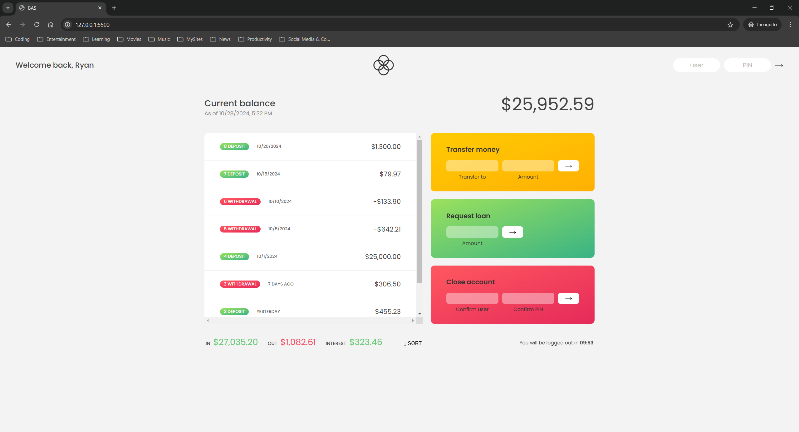

# Bank Account Simulator App

This banking simulator provides a simple and interactive web application to manage multiple user accounts. Users can securely log in, view their transaction history, transfer funds, request loans, and close accounts with ease. Designed with a clean, minimalistic UI, this app provides a practical way to enhance skills in JavaScript, CSS, and HTML while also introducing date formatting, locale-based currency handling, and session management.

[Take a live look at my website powered by Vercel](https://bank-account-simulator.vercel.app/)



## Features

- **Clean and minimalist design**
- **Multi-account support**: Each user has unique transactions, currency, and locale.
- **Fund Transfers**: Easily send money between accounts.
- **Loan Requests**: Conditional loan requests based on account balance.
- **Session Timeout**: Automatic logout after inactivity.
- **Account Closure:** Securely close an account after verifying credentials.

## Usage

### Prerequisites

Clone the repository via Git:

```bash
git clone https://github.com/edg96/BankAccountSimulator
```

### Instructions

After cloning, open the index.html file in your preferred browser to start using the app.

Each user has predefined credentials:

- Ryan Reynolds: Username rr | PIN 1111
- Max Mustermann: Username mm | PIN 2222
- Silviu Faiar: Username sf | PIN 3333

Login to view transaction history, initiate transfers, request loans, or close accounts.

## A Long Advice

This project highlights the importance of web development fundamentals in creating dynamic, interactive web applications:

- HTML defines the structure and organization of the website’s content

- CSS styles the layout, ensuring a responsive and visually engaging design

- JavaScript adds interactivity and handles data dynamically, allowing actions such as logging in, transferring funds, and more

This project is ideal for those wanting to strengthen their skills in web development essentials (HTML, CSS, and JavaScript) while incorporating data handling and real-time updates.
